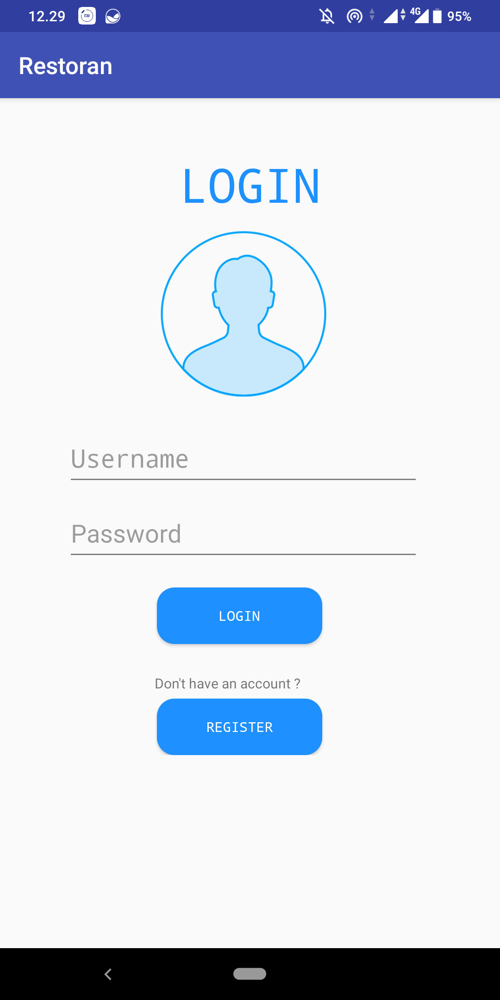
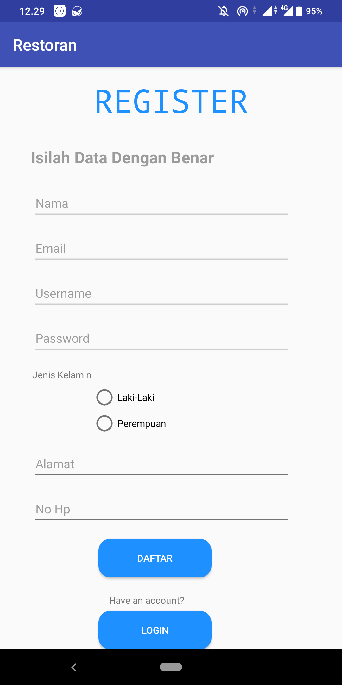
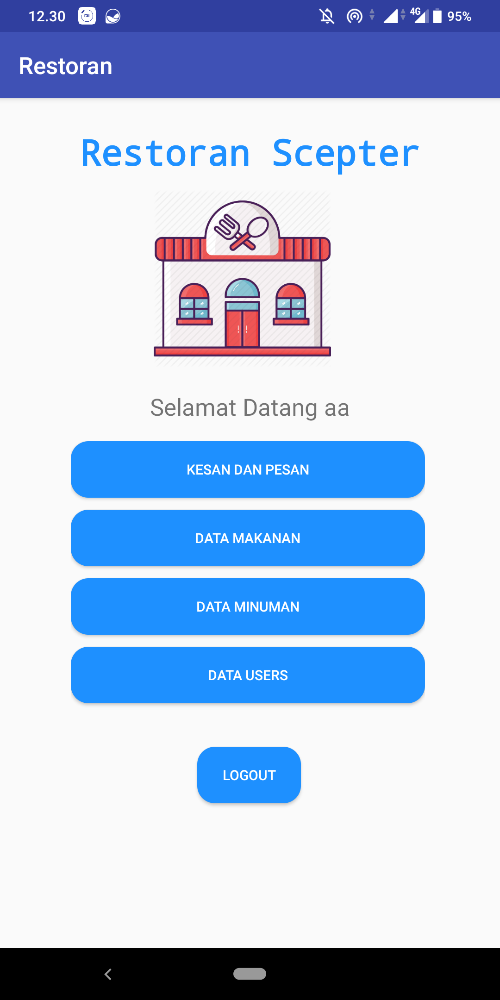
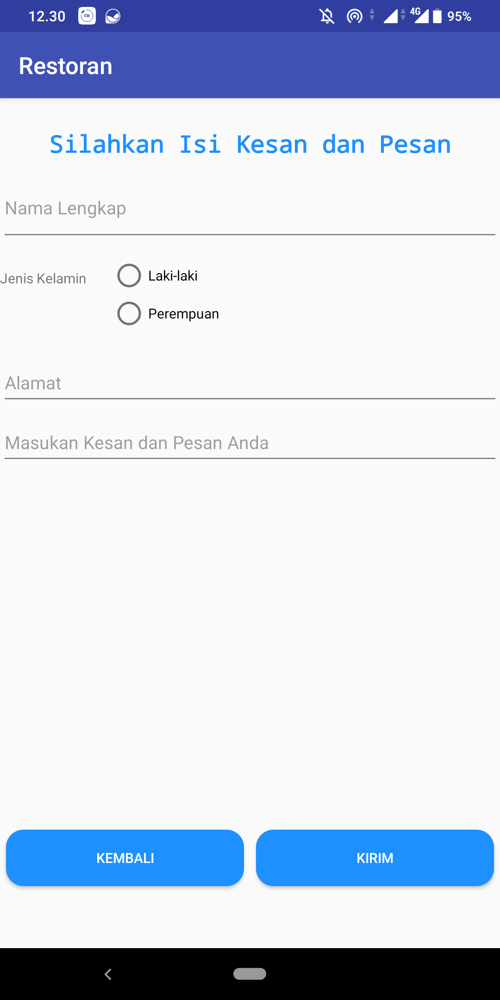
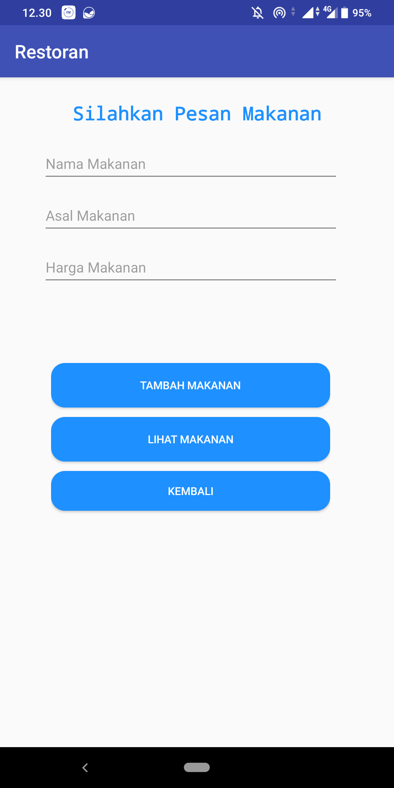
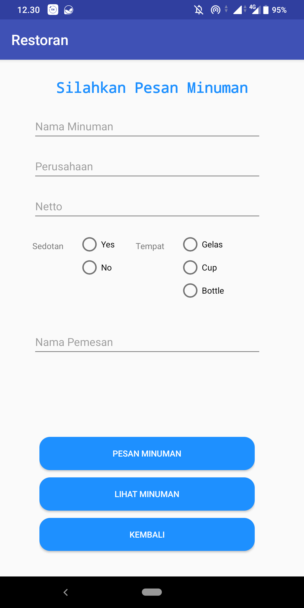
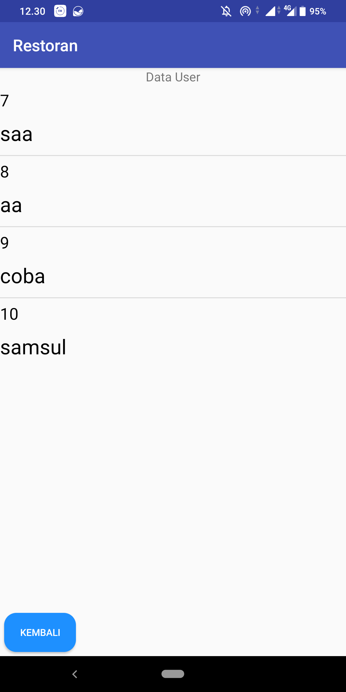

# Simple CRUD MySQL
Simple CRUD Android Studio using Database MySQLMenggunakan REST

<pre>
          

          

</pre>

file untuk frontend web : folder webclient

file untuk webservice/REST: folder web_service

file database 
laporan.sql

Link REST
https://cisted-centimeters.000webhostapp.com/web_service/

link web
https://cisted-centimeters.000webhostapp.com/restoran

tutorial tertulis
https://rizqiakbars.blogspot.com/2020/04/implementasi-rest-modul-php-pada.html

demo youtube
https://youtu.be/Tz4Nb2gOWbQ
